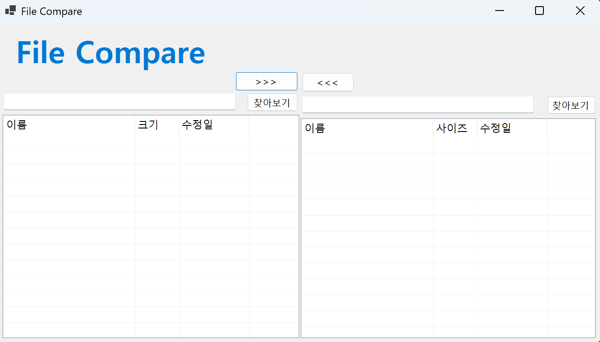
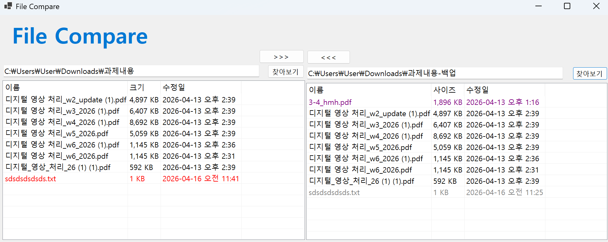
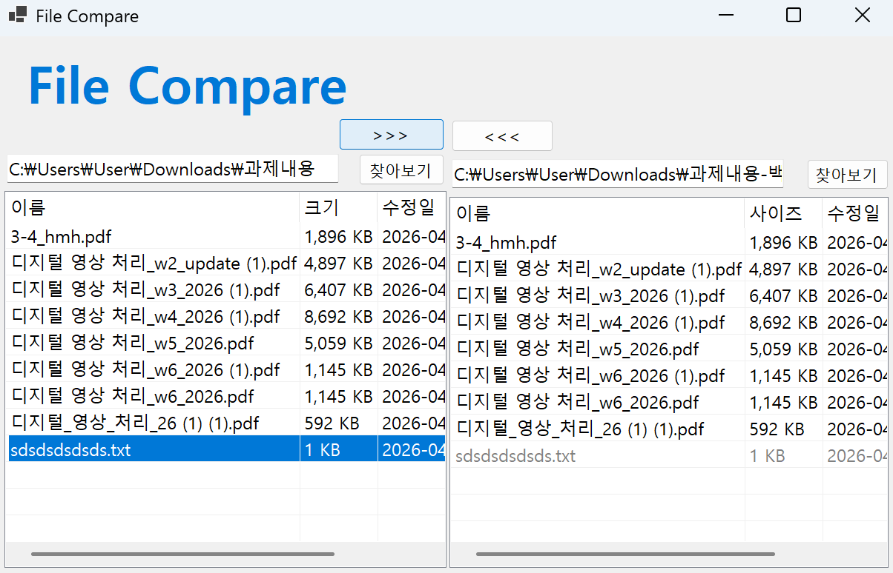
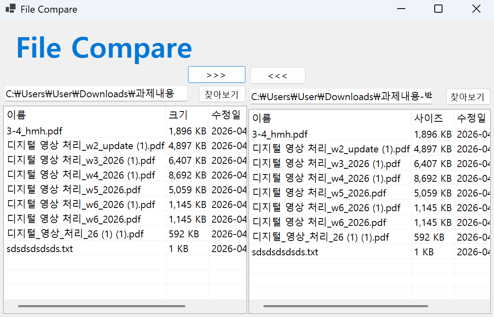
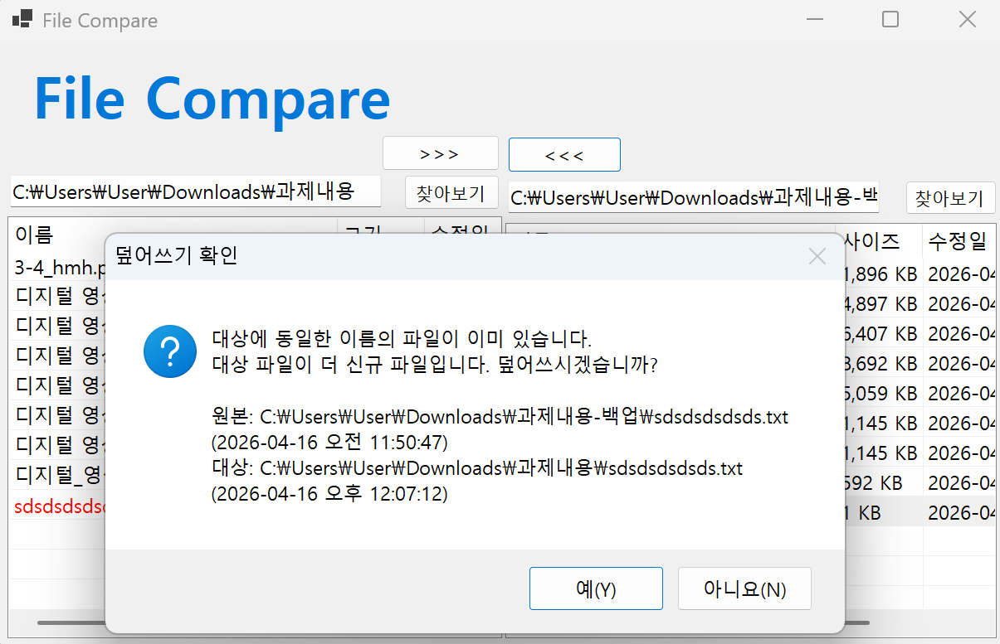
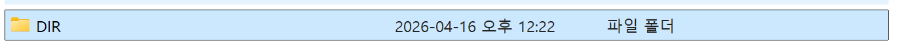
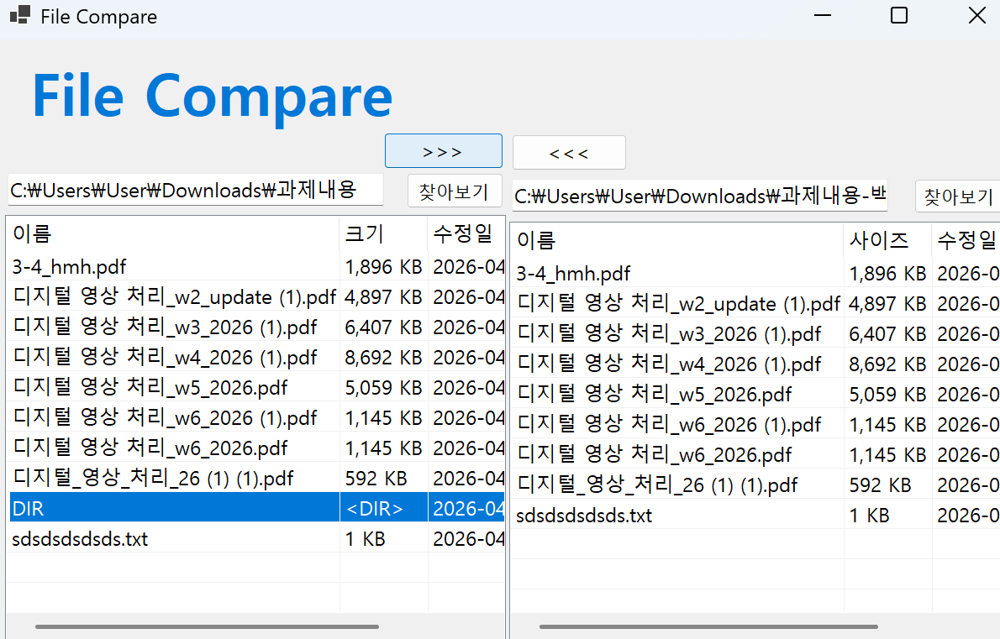
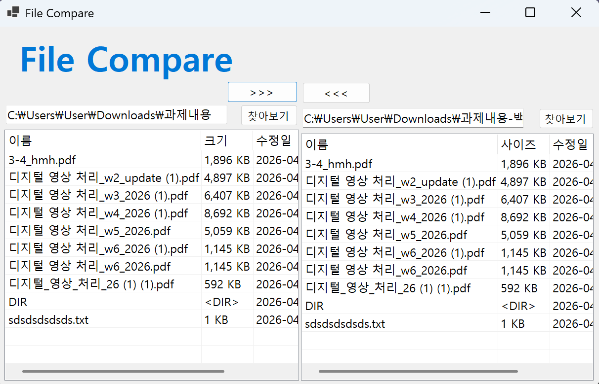

# (C# 코딩) FileCompare

## 개요
- C# 프로그래밍 학습
- 1줄 소개: 두 폴더 간의 파일을 비교하고 상호 복사 및 동기화 기능을 제공하는 파일 관리 도구
- 사용한 플랫폼:
  - C#, .NET Windows Forms, Visual Studio, GitHub
- 사용한 컨트롤:
  - 입력: Button (폴더 선택, 복사 방향 버튼), TextBox (폴더 경로 표시)
  - 출력: ListView (파일 목록 표시 - 이름, 크기, 수정일), Label (상태 표시)
  - 컨테이너: SplitContainer (좌우 폴더 영역 구분), ImageList (아이콘 표시)
- 사용한 기술과 구현한 기능:
  - FolderBrowserDialog를 이용한 로컬 디렉토리 선택 기능
  - DirectoryInfo 및 FileInfo 클래스를 활용한 파일 시스템 탐색
  - ListView의 상세 보기(Details) 모드 및 컬럼 구성
  - 파일 생성 날짜 및 크기 비교 로직을 통한 데이터 무결성 확인
  - File.Copy 메서드를 이용한 파일 상호 복사 구현

## 실행 화면 (과제1)
- 코드의 실행 스크린샷과 구현 내용 설명

  
- 과제 내용 (위 그림 참조)
  - SplitContainer를 활용하여 좌우 대칭형 기본 UI 구성
  - 파일 목록을 표시할 ListView 및 경로 표시용 TextBox, 버튼 배치

- 구현 내용과 기능 설명 (위 그림 참조)
  - SplitContainer의 Orientation을 Vertical로 설정하여 화면을 2등분함
  - ListView의 View 속성을 Details로 설정하고 '이름', '크기', '수정일' 컬럼 추가

## 실행 화면 (과제2)
- 코드의 실행 스크린샷과 구현 내용 설명 

  
- 과제 내용 (위 그림 참조)
  - 폴더 선택 버튼 클릭 시 다이얼로그를 통해 경로 취득 및 표시
  - 선택된 폴더 내의 파일 리스트를 읽어와서 ListView에 출력
  - 파일 이름, 크기, 수정 날짜를 ListViewItem으로 구성하여 추가하고 색상을 이용해서 파일 비교 가능

- 구현 내용과 기능 설명 (위 그림 참조)
  - FolderBrowserDialog로 선택한 경로를 TextBox에 업데이트
  - Directory.GetFiles()를 사용하여 파일 목록을 가져온 후 ListViewItem으로 추가
  - 파일 크기와 수정 날짜를 비교하여 색상으로 구분 (예: 동일한 파일은 흰색, 다른 파일은 노란색)

## 실행 화면 (과제3)
- 코드의 실행 스크린샷과 구현 내용 설명 

  
- 과제 내용
  - 파일 복사 시 동일 파일 존재 여부 확인 및 덮어쓰기 로직 구현
  - 예전 파일 복사시 경고 메시지 구현

- 구현 내용과 기능 설명
  - 선택된 ListViewItem의 정보를 바탕으로 Source/Target 경로 생성
  - File.Exists() 및 수정 시간 비교를 통해 최신 파일 유지 로직 적용
  - 예전 파일 메시지 붙여넣기 시 MessageBox.Show()를 이용하여 사용자에게 덮어쓰기 여부 확인 메시지 표시

## 실행 화면 (과제4)
- 코드의 실행 스크린샷과 구현 내용 설명 

  
- 과제 내용
  - 현재 폴더뿐만 아니라 모든 하위 폴더의 파일까지 비교 대상에 포함
  - 전체 동기화 또는 구조적 복사 기능 구현

- 구현 내용과 기능 설명
  - 재귀 함수(Recursive Function)를 작성하여 하위 디렉토리 구조 탐색
  - 하위 폴더가 대상 경로에 없을 경우 Directory.CreateDirectory()로 자동 생성
  - 폴더 복사 붙여넣기 할 떄 시간 동일하게 하여 같은 파일 취급하게 처리